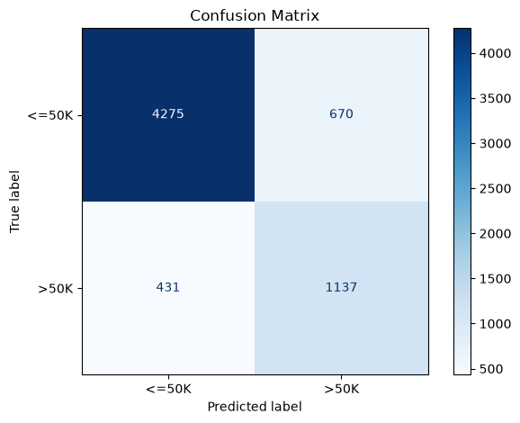
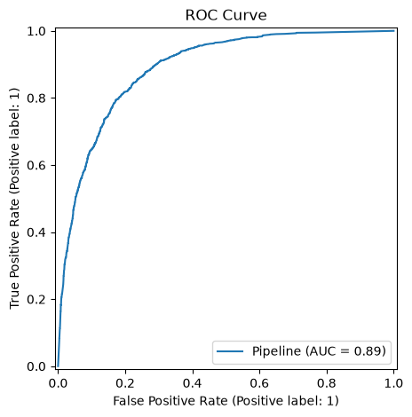
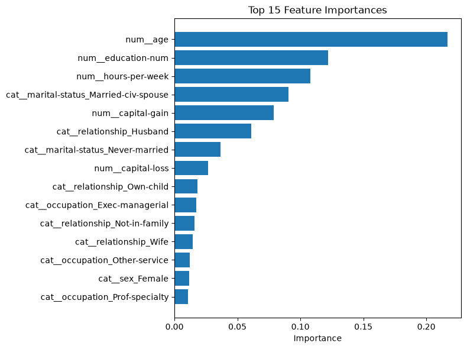

# 💰 Adult Income Classification

A machine learning project that predicts whether a person's annual income exceeds **$50K/year** based on U.S. Census data, using the classic **UCI Adult / Census Income dataset**.

Includes a full pipeline — EDA, preprocessing, model training, evaluation — and an interactive **Streamlit app** for live predictions.

---

## 📌 Problem Statement

Given demographic and employment attributes of an individual (age, education, occupation, hours worked, marital status, etc.), predict whether their income is `>50K` or `<=50K` per year. This is a **binary classification** task on a real-world, moderately imbalanced dataset (~76% `<=50K` vs ~24% `>50K`).

---

## 📊 Dataset

- **Source**: [UCI Machine Learning Repository — Adult Dataset](https://archive.ics.uci.edu/dataset/2/adult) / [Kaggle mirror](https://www.kaggle.com/datasets/uciml/adult-census-income)
- **Rows**: ~32,500 (after cleaning)
- **Target**: `income` (`<=50K` / `>50K`)
- **Features**: age, workclass, education, education-num, marital-status, occupation, relationship, race, sex, capital-gain, capital-loss, hours-per-week, native-country

> The raw dataset uses `"?"` for missing values (mainly in `workclass`, `occupation`, `native-country`), handled during preprocessing.

The CSV itself is **not included** in this repo (see `.gitignore`) — download it from the link above and place it at `data/adult.csv`.

---

## 🗂️ Project Structure

```
AdultIncomeClassification/
│
├── data/                   # adult.csv goes here (gitignored)
├── notebooks/
│   └── Adult_Income_Classification.ipynb   # EDA
├── models/
│   └── random_forest.pkl   # trained pipeline (gitignored)
├── src/
│   ├── data_loader.py      # load + clean raw data
│   ├── preprocess.py       # preprocessing pipeline (impute, encode, scale)
│   ├── train.py            # train Logistic Regression & Random Forest, save best
│   ├── evaluate.py         # metrics + diagnostic plots
│   ├── predict.py          # inference interface (single + batch)
│   └── app.py              # Streamlit UI
├── screenshots/            # EDA plots, evaluation plots, app screenshots
├── requirements.txt
└── README.md
```

---

## ⚙️ Approach

1. **EDA** — explored distributions, missing values, class imbalance, and relationships between features (education, hours-per-week, marital status) and income.
2. **Preprocessing** — dropped redundant/non-predictive columns (`education` in favor of `education-num`, `fnlwgt`), imputed missing values, one-hot encoded categoricals, scaled numerics — all wrapped in a single `sklearn` `ColumnTransformer` + `Pipeline`.
3. **Modeling** — trained and compared **Logistic Regression** (baseline) and **Random Forest**, both with `class_weight="balanced"` to address the imbalance. Selected the best model via 5-fold cross-validated F1 score.
4. **Evaluation** — precision, recall, F1, ROC-AUC, confusion matrix, and feature importance (accuracy alone would be misleading given the imbalance).
5. **Deployment** — wrapped the trained pipeline in a Streamlit app for interactive, real-time predictions.

---

## 📈 Results

| Model               | CV F1 Score | Test F1 | ROC-AUC |
|---------------------|:-----------:|:-------:|:-------:|
| Logistic Regression | 0.66        | —       | —       |
| **Random Forest**    | **0.68**    | —       | —       |

*(Fill in test F1 / ROC-AUC from your `evaluate.py` output.)*

**Top features driving predictions:** capital-gain, education-num, age, hours-per-week, marital-status.

### Sample plots

| Confusion Matrix | ROC Curve | Feature Importance |
|:---:|:---:|:---:|
|  |  |  |

### App demo

| Prediction: ≤50K | Prediction: >50K |
|:---:|:---:|
|  |  |

---

## 🚀 How to Run

### 1. Clone and set up environment

```bash
git clone <your-repo-url>
cd AdultIncomeClassification
python -m venv venv
source venv/bin/activate      # Windows: venv\Scripts\activate
pip install -r requirements.txt
```

### 2. Get the dataset

Download from [Kaggle](https://www.kaggle.com/datasets/uciml/adult-census-income) or [UCI](https://archive.ics.uci.edu/dataset/2/adult) and place it at:
```
data/adult.csv
```

### 3. Train the model

```bash
cd src
python train.py
```

### 4. Evaluate

```bash
python evaluate.py
```

### 5. Run the app

```bash
streamlit run app.py
```

Open `http://localhost:8501` in your browser.

---

## 🛠️ Tech Stack

- **Python**, **pandas**, **NumPy**
- **scikit-learn** — pipelines, preprocessing, modeling, evaluation
- **matplotlib**, **seaborn** — visualization
- **Streamlit** — interactive web app
- **joblib** — model persistence

---

## 🔮 Future Improvements

- Hyperparameter tuning (GridSearchCV / Optuna)
- Try Gradient Boosting (XGBoost/LightGBM/CatBoost)
- SHAP values for model explainability
- Deploy app to Streamlit Community Cloud / Hugging Face Spaces
- Add unit tests for `src/` modules

---

## 📄 License

This project is for educational purposes. Dataset courtesy of the UCI Machine Learning Repository.